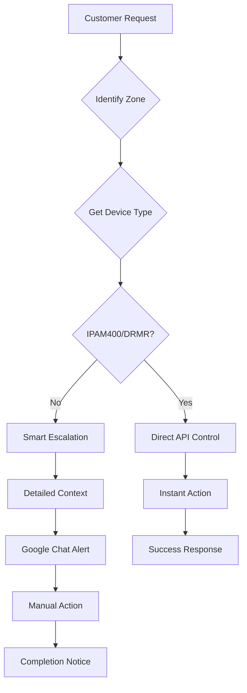

# SYB Complete Capabilities Summary

Last Updated: 2025-01-04

## Device Capability Matrix

Based on comprehensive testing, here's what works for each device type:

| Device Type | Volume | Playback | Skip | Playlist | Schedule | Notes |
|------------|--------|----------|------|----------|----------|--------|
| **IPAM400** (Soundtrack Player) | ✅ | ✅ | ✅ | 🔍 | 🔍 | Full hardware player |
| **DRMR-SVR** (Soundtrack Server) | ✅ | ✅ | ✅ | 🔍 | 🔍 | Server device |
| **Samsung Tablets** | ❌ | ❌ | ❌ | ❌ | ❌ | Display-only |
| **iPad** | ❌ | ❌ | ❌ | ❌ | ❌ | Trial zones |

Legend:
- ✅ = Working via API
- ❌ = Not possible via API
- 🔍 = Under investigation

## Smart Escalation Strategy

The bot now implements intelligent routing based on device type:

### For IPAM400/DRMR Devices (Controllable):
```
Customer: "Turn the volume down at Drift Bar"
Bot: [Detects IPAM400 device]
     [Executes API: set_volume(zone_id, 8)]
     ✅ Volume adjusted to level 8/16 for Drift Bar
```

### For Samsung/iPad Devices (Display-only):
```
Customer: "Turn the volume down at Lobby"
Bot: [Detects Samsung SM-X200]
     [Creates detailed escalation]
     
     🎵 Music Control Request - Lobby
     📱 Device: Samsung SM-X200
        ⚠️ Display-only device (manual adjustment required)
     
     🎯 Action Required: Adjust volume to level 8/16
        How: Use device controls or SYB dashboard
     
     [Sends to Google Chat]
     Response: "I've notified our team. The Lobby uses a display device,
               so they'll adjust the volume manually within 15 minutes."
```

## Working API Controls

### 1. Volume Control ✅
- **Method**: `setVolume(zone_id, level)`
- **Scale**: 0-16 (SYB standard)
- **Works on**: IPAM400, DRMR-SVR devices
- **Response time**: Instant

### 2. Playback Control ✅
- **Methods**: 
  - `play(zone_id)` - Resume playback
  - `pause(zone_id)` - Pause music
  - `skip(zone_id)` - Skip current track
- **Works on**: IPAM400, DRMR-SVR devices
- **Response time**: Instant

### 3. Zone Detection ✅
- **Methods**:
  - `find_venue_zones(venue_name)` - Find all zones
  - `get_zone_status(zone_id)` - Get device info
- **Works on**: All devices
- **Use**: Identifies device type for routing

## Discovered Mutations (113 total)

The SYB API has extensive capabilities that need further testing:

### Potentially Working (Need Investigation):
- `switchPlaylist` - May allow playlist changes
- `blockTrack` - Could block specific songs
- `updateSchedule` - Might modify schedules
- `queueTrack` - Add songs to queue (Unlimited plan required)
- `setMode` - Switch between scheduled/manual modes

### Plan-Restricted Features:
- Queue management requires **Unlimited plan**
- Some features may require **Admin permissions**

## Bot Intelligence Flow



## Example Conversations

### Volume Control (IPAM400)
```
Customer: "Music too loud at Drift Bar"
Bot: ✅ Volume adjusted to level 10/16 for Drift Bar
```

### Playback Control (IPAM400)
```
Customer: "Pause the music at Pool Bar"
Bot: ✅ Playback paused for Pool Bar
```

### Display Device (Samsung)
```
Customer: "Skip this song in Lobby"
Bot: The Lobby uses a display-only device (Samsung SM-X200).
     I've notified our team to skip the track manually.
```

### Playlist Change (All Devices)
```
Customer: "Change to more energetic music"
Bot: [Suggests playlists]
     [Creates escalation with suggestions]
     ✅ Design team notified with your playlist preferences
```

## Implementation Files

1. **syb_control_handler.py**
   - `handle_music_request()` - Smart routing logic
   - `_create_detailed_escalation()` - Rich context for manual actions
   - Device capability matrix

2. **soundtrack_api.py**
   - `set_volume()` - Working volume control
   - `control_playback()` - Play/pause/skip
   - `get_zone_status()` - Device detection

3. **bot_simplified.py**
   - `_handle_playback_control()` - Playback requests
   - `_attempt_volume_fix()` - Volume adjustments
   - Smart device-based routing

## Next Steps

1. **Test playlist switching** - The mutation exists, need correct parameters
2. **Investigate song blocking** - Could be valuable for customer control
3. **Test schedule modifications** - May allow schedule overrides
4. **Explore queue management** - If customer has Unlimited plan

## Key Takeaway

The bot now maximizes automation for controllable devices (IPAM400/DRMR) while providing detailed, actionable escalations for display-only devices (Samsung/iPad). This ensures the best possible customer experience regardless of hardware limitations.